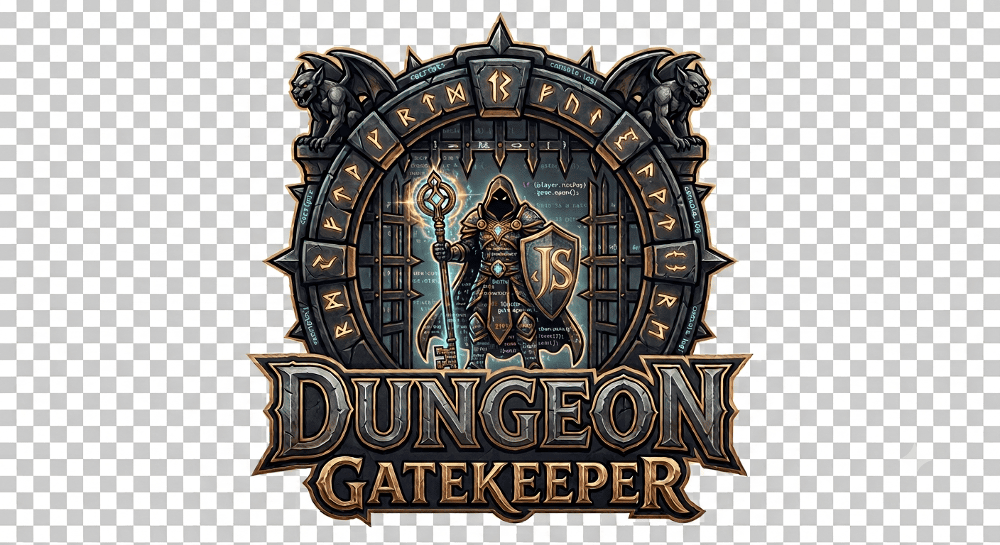

# Dungeon Gatekeeper

  

> *An architectural playground for secure APIs. Guarding the gates against chaos, one claim at a time.*

Welcome to the **Dungeon Gatekeeper** repository! This project is a hands-on, fantasy-themed implementation designed to master modern **Authentication** and **Authorization** patterns using a solid, decoupled architecture.

Behind the flavor text of guilds, ancient keys, and dungeon levels lies a production-ready blueprint addressing the most critical security challenges faced by enterprise APIs today.

## 🗺️ Navigation & Setup

If you are looking to understand the mechanics, flow, and design decisions behind the code, you are in the right place. Dive straight into our comprehensive documentation below:

* **[Core Documentation](CORE.md):** Learn about architecture, token lifecycles, and security strategies.

---

### 🛠️ Tech Stack & Key Concepts

* **Framework:** NestJS (TypeScript) & Passport.js
* **Patterns:** Vertical Slice (`auth/` vs `features/`)
* **Security Pillars:** JWT State Management, RBAC, Dynamic Claims-Based Access, Step-Up Auth, Token Revocation (Blacklisting `jti`), and Rate Limiting.

---